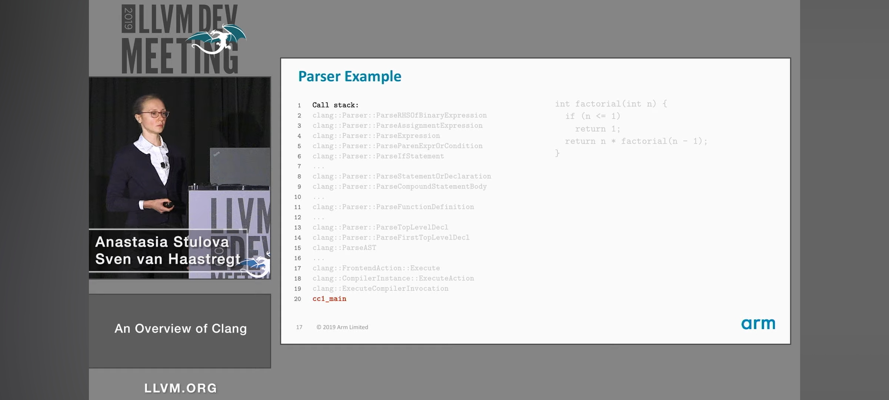

# 


int[] ArrayType

int* Pointertype

int BuiltinType


clang -c -Xclang -ast-dump local/add.c

AST is mostly immutable. exception c++ template

sudo apt install libc++-12-dev libstdc++-12-dev

provide helpful Diagnostics message is important for comipler frontend

AST has api to quey about the program

change remote origin to my fork

git remote set-url origin https://github.com/tannal/llvm-project


```cpp

class Parser : public CodeCompletionHandler {

  Preprocessor &PP;

  /// Tok - The current token we are peeking ahead.  All parsing methods assume
  /// that this is valid.
  Token Tok;
}
```

change a symbol link

ln -sfn ./out/debug/compile_commands.json compile_commands.json 


fast syscall and 


the clang itself is a compiler driver, it's like a d8 for v8 js engine.

the difference is that v8 is embedded as a shared libraray in d8, so we can easily debug and set breakpoint.

but clang launch clang-18 by fork, it's a little bit tricky when debugging.


```bash

sudo apt install gdbserver

gdbserver 192.168.43.95:9999 out/debug/bin/clang local/addc.c -g

sudo perf record  --call-graph=fp out/debug/bin/clang local/addc.c -g

sudo perf report


```


```cpp

// Binary Operators.  'Tok' is the token for the operator.
ExprResult Sema::ActOnBinOp(Scope *S, SourceLocation TokLoc,
                            tok::TokenKind Kind,
                            Expr *LHSExpr, Expr *RHSExpr) {
```

tok::ampamp &

set follow-fork-mode child

call stack

Parsex`RHSOfBinaryExpression
ParseAssignmentExpression
ParseExpression
...
ParseIfStatement
...
ParseStatementOrDeclaration
ParseCompoundStatementBody
ParseFunctionDefinition
compiler driver
main 

top-bottom

recursive decent

sema is the biggest diagnostics subsystem

# frontend



clang parser is a recursive decent parser

clang/include/clang/Basic/TokenKinds.def

clang/include/clang/Parse/Parser.h

clang/lib/Sema/SemaDecl.cpp


C99_KEYWORD(inline                      , KEYCXX|KEYGNU)
KEYWORD 


```cpp
// add.c


int add(int x, int y) {
    return x + y;
}

// clang -c -Xclang -dump-tokens add.c
int 'int'        [StartOfLine]  Loc=<add.c:2:1>
identifier 'add'         [LeadingSpace] Loc=<add.c:2:5>
l_paren '('             Loc=<add.c:2:8>
int 'int'               Loc=<add.c:2:9>
identifier 'x'   [LeadingSpace] Loc=<add.c:2:13>
comma ','               Loc=<add.c:2:14>
int 'int'        [LeadingSpace] Loc=<add.c:2:16>
identifier 'y'   [LeadingSpace] Loc=<add.c:2:20>
r_paren ')'             Loc=<add.c:2:21>
l_brace '{'      [LeadingSpace] Loc=<add.c:2:23>
return 'return'  [StartOfLine] [LeadingSpace]   Loc=<add.c:3:5>
identifier 'x'   [LeadingSpace] Loc=<add.c:3:12>
plus '+'         [LeadingSpace] Loc=<add.c:3:14>
identifier 'y'   [LeadingSpace] Loc=<add.c:3:16>
semi ';'                Loc=<add.c:3:17>
r_brace '}'      [StartOfLine]  Loc=<add.c:4:1>
eof ''          Loc=<add.c:4:2>


```

```bash

sudo apt install gcc g++

mkdir -p out/debug
mkdir -p out/release

cmake -S llvm -B out/release -G Ninja -DLLVM_ENABLE_PROJECTS='clang;lld' -DCMAKE_BUILD_TYPE='release' -DLLVM_ENABLE_RUNTIMES='openmp'  -DLLVM_USE_LINKER=lld -DCMAKE_EXPORT_COMPILE_COMMANDS=ON -DLLVM_BUILD_LLVM_DYLIB=ON -DLLVM_LINK_LLVM_DYLIB=ON

cmake -S llvm -B out/debug -G Ninja -DLLVM_ENABLE_PROJECTS='clang;lld' -DCMAKE_BUILD_TYPE='Debug' -DLLVM_ENABLE_RUNTIMES='openmp'  -DLLVM_USE_LINKER=lld -DCMAKE_EXPORT_COMPILE_COMMANDS=ON -DLLVM_BUILD_LLVM_DYLIB=ON -DLLVM_LINK_LLVM_DYLIB=ON -DCMAKE_C_FLAGS_DEBUG="-g3 -Og" -DCMAKE_CXX_FLAGS_DEBUG="-g3 -Og"

ninja -C out/debug clean

ninja -C out/debug


```

C file and flags

preprocessor frontend -> preprocessor & lexer tokens

parser sema -> AST

CodeGen LLVM IR

TargetInfo Diagnostics subsystem LangOptions SourceMgr

fast path


clang is a compiler driver

preprocessing compiling linking


flags -I -L


CFE cc1 clang_cc1

compile to LLVM IR

input

preproccessor

compiler

backend

assember

linker


