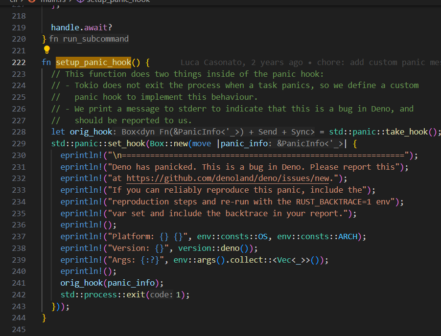

# people

involves:piscisaureus 
involves:scott_hammond

involves:bartlomieju
involves:nayeemrmn
involves:dsherret
involves:petamoriken
involves:crowlKats
involves:kt3k
involves:lucacasonato

involves:ljharb
involves:surma
involves:MylesBorins
involves:benjamingr
involves:targos
involves:tniessen
involves:lucacasonato
involves:andreubotella
involves:legendecas
involves:ryzokuken
involves:crowlKats
involves:CanadaHonk
involves:danielroe
involves:littledivy
involves:RaisinTen


# setup

```

git clone https://github.com/denoland/deno
cd ~/tannalwork/projects/deno

git submodule update --init .

sudo apt install protobuf-compiler

cargo test file_fetcher::tests::test_fetch_gzip

cargo test tsc::tests::test_emit_tsbuildinfo

cargo test --package deno --test integration_tests -- integration::repl::console_log --exact --nocapture

cargo test module::module::

```

# inbox

https://github.com/denoland/deno_core/pull/471

spawn_subcommand

bail! macro

https://github.com/denoland/deno/pull/20491/commits/5639614c5bdb7d452f3fb7cf68d7d4d7317cdda9

lsp::diagnostic

#6  0x0000555561307161 in v8::isolate::Isolate::new (params=...) at src/isolate.rs:581
#7  0x0000555560cc9169 in deno_core::runtime::jsruntime::JsRuntime::new_inner (
    options=..., will_snapshot=false) at runtime/jsruntime.rs:769
#8  0x0000555560cc74a1 in deno_core::runtime::jsruntime::JsRuntime::new (options=...)
    at runtime/jsruntime.rs:595
#9  0x000055555a4d0dcb in deno::lsp::tsc::run_tsc_thread (request_rx=..., performance=..., 
    cache=..., specifier_map=..., maybe_inspector_server=...) at cli/lsp/tsc.rs:4082
#10 0x000055555ac643ab in deno::lsp::tsc::{impl#2}::start::{closure#1} ()
    at cli/lsp/tsc.rs:271

tokio::spawn

Deno[Deno.internal]

@Luca can't code so you can't cross-compile Deno (or Node, I guess) because the build involves making V8 pre-compile the JS code that comes built into Deno (that implements the Deno APIs, for example), and the result is platform-specific
so Deno releases versions for the platforms Github Actions supports, plus a Mac M2 build that has to be done manually with every release by someone in the Deno core team

Deno, where there are only about 25 full-time employees.

having what I do every day visibly contribute to the company’s trajectory.


```bash

rustup show

rustup update

rustup default

rustup default stable
rustup default nightly

rm -rf ~/.rustup/toolchains/1.75.0-x86_64-unknown-linux-gnu/

```


feat(lsp): allow to connect V8 inspector (denoland#21482)
https://github.com/tannal/deno/commit/cdbf902499dc62a4fb9f8cbf2a47a7b446623929

Pythia 12B

# directory structure

tools/ deno subcommand ex tools/info.rs -> deno info

cli/ It's responsible for overseeing tasks such as module loading, security checks, and runtime environment management.



# build run testing logging

```bash

#[test]d

#[cfg(test)]
mod tests {}


cargo test node
cargo test lsp
cargo test tsc

```
# deno lsp

deno_tsc 00_typescript.js

vscode_deno/client/src/commands.ts startLanguageServer

vscode has language client and many interrnal language server

vscode_deno use the deno cli is a language server


extensions/typescript-language-features
extensions/css-language-features/client/src/browser/cssClientMain.ts


```bash

Starting Deno language server...
  version: 1.39.2 (debug, x86_64-unknown-linux-gnu)
  executable: /home/tannal/tannalwork/projects/deno/target/debug/deno
Connected to "Visual Studio Code" 1.85.1
Enabling import suggestions for: https://deno.land
Download https://deno.land/.well-known/deno-import-intellisense.json
Hit the language server document preload limit of 1000 file system entries. You may want to use the "deno.enablePaths" configuration setting to only have Deno partially enable a workspace or increase the limit via "deno.documentPreloadLimit". In cases where Deno ends up using too much memory, you may want to lower the limit.
Could not set npm package requirements. Error getting response at https://registry.npmjs.org/@types/node for package "@types/node": An npm specifier not found in cache: "@types/node", --cached-only is specified.
Server ready.

```


# rust

std::fmt::Result

std::error::Error

fn create_and_run_current_thread_inner<F, R>(
  future: F,
  metrics_enabled: bool,
) -> R
where
  F: std::future::Future<Output = R> + 'static,
  R: Send + 'static,

future is like promise

The + 'static lifetime ensures that the future can live for the duration of the program.


# debug in vscode


```json

{
    // Launch configuration for debugging Rust code inside VS Code with LLDB
    // This configuration is used by the extension 'LLDB Debugger'
    // 
    // The necessary extension may be downloaded at: https://marketplace.visualstudio.com/items?itemName=vadimcn.vscode-lldb
    // Alternatively, the repository for it may be found at: https://github.com/vadimcn/vscode-lldb.git
    
    "version": "0.1.0",
    "configurations": [
        {
            "name": "Debug with LLDB",
            "type": "lldb",
            "request": "launch",
            // The following configuration option, 'program', may in some cases need to be modified. 
            // This is so that the correct executable is targeted.
            // For example, on non-Windows systems, the ".exe" suffix must be removed. 
            // Alternatively, the directory that rustc/cargo outputs debug builds may change in future
            // As such, this path would have to change accordingly.
            "program": "${workspaceFolder}/target/debug/${workspaceFolderBasename}.exe",
            // If you wish to supply arguments/parameters to the program, supply them below:
            "args": [],
            // Working folder for execution. Change as necessary if program requires a different value:
            "cwd": "${workspaceFolder}",
            "terminal": "external",
            "stopOnEntry": false,
            // Instructs LLVM to apply special Rust-language-specific functionality to its analysis:
            "sourceLanguages": ["rust"]
        }
    ]
}

```


# community

https://discord.com/channels/684898665143206084/684911491035430919