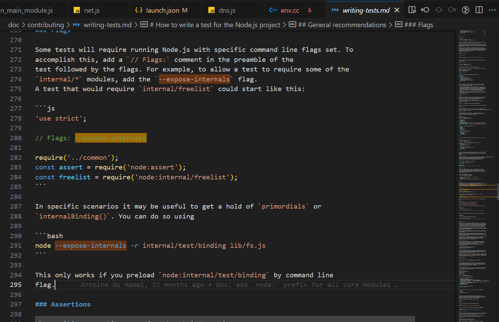
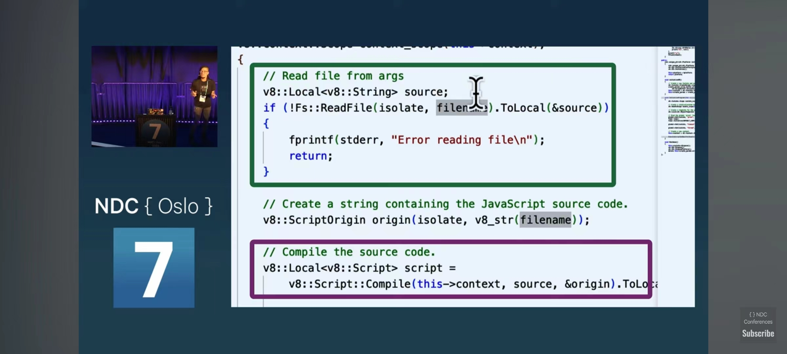
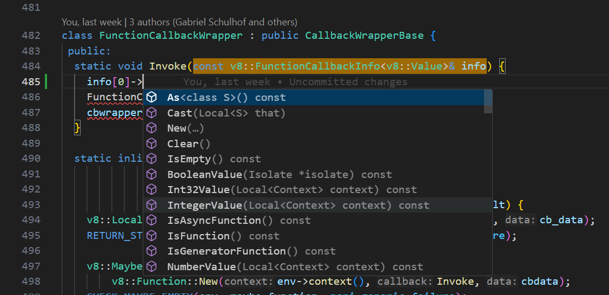

# dev

tools/test.py -m debug test/parallel/test-options.js --shell ./node_g  --report --node-args --track-heap-objects

export NODE_OPTIONS='--expose-internals'

./node --inspect-brk=0.0.0.0:9229 test/parallel/test-net-server-close-before-calling-lookup-callback.js

./node test/parallel/test-webstreams-clone-unref.js

./node --inspect-brk=0.0.0.0:9229-node local/fetch.mjs

source ~/tannalwork/projects/v8/v8/tools/gdbinit

# inbox

sudo perf record -F 99 --call-graph dwarf -p `pgrep -n node_g` -g -- sleep 30
sudo perf script > ./graph/out.nodestacks02

export FBASE=$WORK/projects/FlameGraph/
$FBASE/stackcollapse-perf.pl < $FBASE/graph/out.nodestacks02 | $FBASE/flamegraph.pl > $FBASE/graph/out.nodestacks02.svg


node::StreamBase::WriteString<(node::encoding)1>

Runtime_LoadPropertyWithInterceptor

sudo perf trace -e 'syscalls:sys_enter_read,syscalls:sys_exit_read,syscalls:sys_enter_write,syscalls:sys_exit_write' -p `pgrep -n node` -o io_events.trace sleep 30

https://stackoverflow.com/questions/27842281/unknown-events-in-nodejs-v8-flamegraph-using-perf-events

sudo perf record -F 99 -p `pgrep -n node` -g -- sleep 30
sudo perf script > out.nodestacks01

./stackcollapse-perf.pl < ~/tannalwork/projects/node/out.nodestacks01 | ./flamegraph.pl > ./out.nodestacks01.svg

./node_g --prof ~/tannalwork/cans/add.js

./node_g --prof-process isolate-*.log > processed.txt

jst jco job

Serilizer
HeapObject


# setup

```bash
git clone https://github.com/tannal/node.git

git remote add upstream https://github.com/nodejs/node
git fetch upstream v18.x

./configure --ninja --debug --v8-with-dchecks -C --node-builtin-modules-path $(pwd)
time make -j23

ninja -C out/Debug/ -t compdb > compile_commands.json


```bash
// .vscode/launch.json
{
  "version": "0.2.0",
  "configurations": [
    {
      "name": "(lldb) Launch",
      "type": "lldb",
      "request": "launch",
      "program": "${workspaceFolder}/out/Release/node",
      "args": [
        "--expose-internals",
        "test.js"
      ],
      "stopAtEntry": false,
      "cwd": "${workspaceFolder}",
      "environment": [],
      "externalConsole": true,
      "MIMode": "lldb"
    }
  ]
}
```

```bash
"compileCommands": "${workspaceFolder}/out/Debug/compile_commands.json"
```


# people

involves:joyeecheung
involves:targos
involves:anonrig
involves:aduh95
involves:tniessen
involves:RafaelGSS
involves:MoLow
involves:marco-ippolito
involves:legendecas
involves:cjihrig
involves:lpinca
involves:mhdawson
involves:atlowChemi
involves:panva
involves:richardlau
involves:Trott
involves:deokjinkim
involves:zcbenz
involves:GeoffreyBooth
involves:LiviaMedeiros
involves:ronag
involves:jasnell
involves:VoltrexKeyva
involves:theanarkh
involves:ShogunPanda
involves:mcollina
involves:daeyeon
involves:RaisinTen
involves:cola119
involves:benjamingr
involves:santigimeno
involves:bnoordhuis
involves:addaleax
involves:codebytere
involves:ruyadorno
involves:himself65
involves:gengjiawen
involves:juanarbol
involves:guybedford
involves:indutny
involves:cclauss
involves:Flarna
involves:mmarchini
involves:JacksonTian
involves:TimothyGu
involves:isaacs
involves:XadillaX
involves:fhinkel
involves:bengl
involves:srl295
involves:BethGriggs
involves:devsnek

involves:lundibundi

involves:ljharb
involves:jasnell
involves:theanarkh

involves:Qard
involves:joyeecheung
involves:isaacs
involves:izs
involves:mikeal
involves:ovflowd
involves:mhdawson
involves:mcollina
involves:mylesborins

# concurrent model

node has typically 4-6 platform worker thread
V8Platform -> NodePlatform class has a reference to worker_thread_task_runner_ which has a reference to threads_
NodeMainInstance has a reference to a MultiIsolatePlatform

node has a watchdog thread
node_watchdog.h

node has a inspector thread client server architecture just like gdb


# inbox

Debug() from src/debug_utils.h
NODE_DEBUG

export TARGET_ARCH=x64
export BUILD_ARCH_TYPE=x64.debug

gn gen -v "out.gn/$BUILD_ARCH_TYPE" --args="is_component_build=false is_debug=true use_goma=false goma_dir=\"None\" use_custom_libcxx=false v8_target_cpu=\"$TARGET_ARCH\" target_cpu=\"$TARGET_ARCH\" v8_enable_backtrace=true"

export BUILD_ARCH_TYPE=x64.debug
export JOBS_ARG=22

ninja -v -C "out.gn/$BUILD_ARCH_TYPE" d8 cctest inspector-test

The __esModule property is commonly used to recognize transpiled ES modules in consuming code.

--expose-internals

git remote add upstream https://github.com/nodejs/node

git fetch upstream v18.x

./configure --ninja --debug --v8-with-dchecks
time make -j23

rb js-objects.cc:.

gdb --args node_g test/parallel/test-vm-context.js

nodejs performance team
https://github.com/search?q=involves%3Abenjamingr%20&type=issues
https://github.com/search?q=involves%3AMoLow%20&type=issues

ringbuffer 

b MacrotaskQueue::RunMacrotasks

```cpp

void MicrotaskQueue::EnqueueMicrotask(Tagged<Microtask> microtask) {
  if (size_ == capacity_) {
    // Keep the capacity of |ring_buffer_| power of 2, so that the JIT
    // implementation can calculate the modulo easily.
    intptr_t new_capacity = std::max(kMinimumCapacity, capacity_ << 1);
    ResizeBuffer(new_capacity);
  }

  DCHECK_LT(size_, capacity_);
  ring_buffer_[(start_ + size_) % capacity_] = microtask.ptr();
  ++size_;
}

V8's micro task queue
  isolate->GetCurrentContext()->GetMicrotaskQueue()
      ->EnqueueMicrotask(isolate, args[0].As<Function>());


```

SourceTextModule->GetStalledTopLevelAwaitMessage

v8 module

src/node_contextify.cc
if (ProcessEmitWarningSync(env,
                            "(To load an ES module, set \"type\": "
                            "\"module\" in the package.json "
                            "or use the .mjs extension.)")

MaybeLocal<Value> LoadEnvironment(
    Environment* env,
    StartExecutionCallback cb) {
  env->InitializeLibuv();
  env->InitializeDiagnostics();

  return StartExecution(env, cb);
}

src: implement --trace-promises
https://github.com/nodejs/node/commit/1e31a01f898a3586faf01480928161f2f5ef965d

ln -sfn ./out/Release/compile_commands.json .

mksnapshot and requireBuiltin lib/internal/bootstrap/realm.js

Addons are dynamically-linked shared objects written in C++. The require() function can load addons as ordinary Node.js modules. Addons provide an interface between JavaScript and C/C++ libraries.

JNI in node binding.gyp

--inspect-brk-node

./configure --ninja --debug && make -j22


 make -j4 test (UNIX), or vcbuild test (Windows) passes
tests and/or benchmarks are includede
documentation is changed or added
commit message follows commit guidelines

git reset --soft ec6ddcecbfdbd66c96d6f40fda8da5162544093e


node threads
PlatformWorkerThread 5 
node::WorkerThreadsTaskRunner::DelayedTaskScheduler::Start() 1

gdb ./node

r test/parallel/test-webstreams-clone-unref.js

[js] stream: fix cloned webstreams not being unref correctly
process doesn't exit
https://github.com/nodejs/node/blob/2a33e950937a2645da9679f19bbdfe18f881dfa6/src/node_main_instance.cc#L124

git commit --amend


tools/test.py test/parallel/test-stream2-transform.js


https://github.com/npm/

```cpp

if (env->options()->debug_options().break_first_line) {
  env->inspector_agent()->PauseOnNextJavascriptStatement("Break on start");
}

```

https://github.com/nodejs/node/pulls/joyeecheung


ECMAScript Spec

https://chat.openai.com/g/g-DTk1KpYjg-pdf-translator-gpt

nodejs bun deno




```js

console.log('Hello World' + new Date().toISOString())

```

context isolate

global object set key value

Isolate* isolate = context->GetIsolate();
EscapableHandleScope handle_scope(isolate);

Local<Object> global = context->Global();

void Print(const v8::FunctionCallbackInfo<v8::Value>& info);



Local<Value> arg = info[i];

```cpp

// src/util.cc
Local<v8::FunctionTemplate> NewFunctionTemplate(
    v8::Isolate* isolate,
    v8::FunctionCallback callback,
    Local<v8::Signature> signature,
    v8::ConstructorBehavior behavior,
    v8::SideEffectType side_effect_type,
    const v8::CFunction* c_function) {
  return v8::FunctionTemplate::New(isolate,
                                   callback,
                                   Local<v8::Value>(),
                                   signature,
                                   0,
                                   behavior,
                                   side_effect_type,
                                   c_function);
}

Local<FunctionTemplate> SocketAddressBlockListWrap::GetConstructorTemplate(
    Environment* env) {
  Local<FunctionTemplate> tmpl = env->blocklist_constructor_template();
  if (tmpl.IsEmpty()) {
    Isolate* isolate = env->isolate();
    tmpl = NewFunctionTemplate(isolate, SocketAddressBlockListWrap::New);
    tmpl->SetClassName(FIXED_ONE_BYTE_STRING(env->isolate(), "BlockList"));
    tmpl->InstanceTemplate()->SetInternalFieldCount(kInternalFieldCount);
    SetProtoMethod(isolate, tmpl, "addAddress", AddAddress);
    SetProtoMethod(isolate, tmpl, "addRange", AddRange);
    SetProtoMethod(isolate, tmpl, "addSubnet", AddSubnet);
    SetProtoMethod(isolate, tmpl, "check", Check);
    SetProtoMethod(isolate, tmpl, "getRules", GetRules);
    env->set_blocklist_constructor_template(tmpl);
  }
  return tmpl;
}

// Store primordials setup by the per-context script in the environment.
Local<Object> per_context_bindings =
    GetPerContextExports(ctx).ToLocalChecked();
Local<Value> primordials =
    per_context_bindings->Get(ctx, env_->primordials_string())
        .ToLocalChecked();
CHECK(primordials->IsObject());
set_primordials(primordials.As<Object>());

```


 

node::inspector::NodeInspectorClient::runMessageLoopOnPause

node:internal/main/run_main_module

worker thread

'use strict';

// Flags: --expose-internals

require('../common');
const assert = require('node:assert');
const freelist = require('node:internal/freelist');

node lib module is lazy loaded when needing, so if you are not see the file when debugging.

It's beacause they are not loaded.


nodejs use openssl for web crypto api and tls connection https://github.com/openssl/openssl.git

```js
// nodejs dns lookup
// Easy DNS A/AAAA look up
// lookup(hostname, [options,] callback)
const validFamilies = [0, 4, 6];
function lookup(hostname, options, callback) {

uv__getaddrinfo_work

```

about:debugging

node env context

isolate

## testing

cctest

## debugging

> The source code of Node.js itself is primarily written in C++ and JavaScript. The JS part is mostly under the lib directory and the C++ part is mostly under the src directory. There are also a bunch of third-party dependencies like v8 or libuv which are placed under the deps directory.

> The Node.js release binaries do not strip the debug symbols (surprised?) so you don’t necessarily have to build a debug build to get meaningful C/C++ stack traces or to do step debugging in a native debugger like LLDB or GDB.


## lsp

clangd

TSServer

[error] TSServer exited. Code: null. Signal: SIGTERM


# community


# reference

https://joyeecheung.github.io/blog/2018/12/31/tips-and-tricks-node-core/

# appendix

 1: 0x55af33c8fd3c node::DumpNativeBacktrace(_IO_FILE*) [./node_g]
 2: 0x55af33ec0ca1  [./node_g]
 3: 0x55af33ec0cc5  [./node_g]
 4: 0x55af3659e692 V8_Fatal(char const*, int, char const*, ...) [./node_g]
 5: 0x55af3659e6db  [./node_g]
 6: 0x55af34475607 v8::internal::Debug::Break(v8::internal::JavaScriptFrame*, v8::internal::Handle<v8::internal::JSFunction>) [./node_g]
 7: 0x55af34df043f  [./node_g]
 8: 0x55af34df0a07 v8::internal::Runtime_DebugBreakOnBytecode(int, unsigned long*, v8::internal::Isolate*) [./node_g]
 9: 0x55aed5885476 


  1: 0x56282d88fd3c node::DumpNativeBacktrace(_IO_FILE*) [./node_g]
 2: 0x56282dac0ca1  [./node_g]
 3: 0x56282dac0cc5  [./node_g]
 4: 0x56283019e692 V8_Fatal(char const*, int, char const*, ...) [./node_g]
 5: 0x56283019e6db  [./node_g]
 6: 0x56282ea85f44 v8::internal::DebugInfo::DebugBytecodeArray(v8::internal::Isolate*) [./node_g]
 7: 0x56282ea8b852 v8::internal::CodeSerializer::SerializeObjectImpl(v8::internal::Handle<v8::internal::HeapObject>, v8::internal::SerializerDeserializer::SlotType) [./node_g]
 8: 0x56282eac18b5 v8::internal::Serializer::ObjectSerializer::VisitPointers(v8::internal::Tagged<v8::internal::HeapObject>, v8::internal::FullMaybeObjectSlot, v8::internal::FullMaybeObjectSlot) [./node_g]
 9: 0x56282e7c6c34 v8::internal::HeapObject::IterateBody(v8::internal::Tagged<v8::internal::Map>, int, v8::internal::ObjectVisitor*) [./node_g]
10: 0x56282eac27ea v8::internal::Serializer::ObjectSerializer::SerializeContent(v8::internal::Tagged<v8::internal::Map>, int) [./node_g]
11: 0x56282eac68ec v8::internal::Serializer::ObjectSerializer::Serialize(v8::internal::SerializerDeserializer::SlotType) [./node_g]
12: 0x56282ea8b06b v8::internal::CodeSerializer::SerializeGeneric(v8::internal::Handle<v8::internal::HeapObject>, v8::internal::SerializerDeserializer::SlotType) [./node_g]
13: 0x56282ea8b27d v8::internal::CodeSerializer::SerializeObjectImpl(v8::internal::Handle<v8::internal::HeapObject>, v8::internal::SerializerDeserializer::SlotType) [./node_g]
14: 0x56282eac18b5 v8::internal::Serializer::ObjectSerializer::VisitPointers(v8::internal::Tagged<v8::internal::HeapObject>, v8::internal::FullMaybeObjectSlot, v8::internal::FullMaybeObjectSlot) [./node_g]
15: 0x56282e7c6c34 v8::internal::HeapObject::IterateBody(v8::internal::Tagged<v8::internal::Map>, int, v8::internal::ObjectVisitor*) [./node_g]
16: 0x56282eac27ea v8::internal::Serializer::ObjectSerializer::SerializeContent(v8::internal::Tagged<v8::internal::Map>, int) [./node_g]
17: 0x56282eac68ec v8::internal::Serializer::ObjectSerializer::Serialize(v8::internal::SerializerDeserializer::SlotType) [./node_g]
18: 0x56282ea8b06b v8::internal::CodeSerializer::SerializeGeneric(v8::internal::Handle<v8::internal::HeapObject>, v8::internal::SerializerDeserializer::SlotType) [./node_g]
19: 0x56282ea8b457 v8::internal::CodeSerializer::SerializeObjectImpl(v8::internal::Handle<v8::internal::HeapObject>, v8::internal::SerializerDeserializer::SlotType) [./node_g]
20: 0x56282eac18b5 v8::internal::Serializer::ObjectSerializer::VisitPointers(v8::internal::Tagged<v8::internal::HeapObject>, v8::internal::FullMaybeObjectSlot, v8::internal::FullMaybeObjectSlot) [./node_g]
21: 0x56282e7c6c34 v8::internal::HeapObject::IterateBody(v8::internal::Tagged<v8::internal::Map>, int, v8::internal::ObjectVisitor*) [./node_g]
22: 0x56282eac27ea v8::internal::Serializer::ObjectSerializer::SerializeContent(v8::internal::Tagged<v8::internal::Map>, int) [./node_g]
23: 0x56282eac68ec v8::internal::Serializer::ObjectSerializer::Serialize(v8::internal::SerializerDeserializer::SlotType) [./node_g]
24: 0x56282ea8b06b v8::internal::CodeSerializer::SerializeGeneric(v8::internal::Handle<v8::internal::HeapObject>, v8::internal::SerializerDeserializer::SlotType) [./node_g]
25: 0x56282ea8b600 v8::internal::CodeSerializer::SerializeObjectImpl(v8::internal::Handle<v8::internal::HeapObject>, v8::internal::SerializerDeserializer::SlotType) [./node_g]
26: 0x56282eac18b5 v8::internal::Serializer::ObjectSerializer::VisitPointers(v8::internal::Tagged<v8::internal::HeapObject>, v8::internal::FullMaybeObjectSlot, v8::internal::FullMaybeObjectSlot) [./node_g]
27: 0x56282e7c6c34 v8::internal::HeapObject::IterateBody(v8::internal::Tagged<v8::internal::Map>, int, v8::internal::ObjectVisitor*) [./node_g]
28: 0x56282eac27ea v8::internal::Serializer::ObjectSerializer::SerializeContent(v8::internal::Tagged<v8::internal::Map>, int) [./node_g]
29: 0x56282eac68ec v8::internal::Serializer::ObjectSerializer::Serialize(v8::internal::SerializerDeserializer::SlotType) [./node_g]
30: 0x56282ea8b06b v8::internal::CodeSerializer::SerializeGeneric(v8::internal::Handle<v8::internal::HeapObject>, v8::internal::SerializerDeserializer::SlotType) [./node_g]
31: 0x56282ea8b27d v8::internal::CodeSerializer::SerializeObjectImpl(v8::internal::Handle<v8::internal::HeapObject>, v8::internal::SerializerDeserializer::SlotType) [./node_g]
32: 0x56282e7c6c34 v8::internal::HeapObject::IterateBody(v8::internal::Tagged<v8::internal::Map>, int, v8::internal::ObjectVisitor*) [./node_g]
33: 0x56282eac27ea v8::internal::Serializer::ObjectSerializer::SerializeContent(v8::internal::Tagged<v8::internal::Map>, int) [./node_g]
34: 0x56282eac68ec v8::internal::Serializer::ObjectSerializer::Serialize(v8::internal::SerializerDeserializer::SlotType) [./node_g]
35: 0x56282ea8b06b v8::internal::CodeSerializer::SerializeGeneric(v8::internal::Handle<v8::internal::HeapObject>, v8::internal::SerializerDeserializer::SlotType) [./node_g]
36: 0x56282ea8b27d v8::internal::CodeSerializer::SerializeObjectImpl(v8::internal::Handle<v8::internal::HeapObject>, v8::internal::SerializerDeserializer::SlotType) [./node_g]
37: 0x56282eac18b5 v8::internal::Serializer::ObjectSerializer::VisitPointers(v8::internal::Tagged<v8::internal::HeapObject>, v8::internal::FullMaybeObjectSlot, v8::internal::FullMaybeObjectSlot) [./node_g]
38: 0x56282e78f038  [./node_g]
39: 0x56282e7c6c34 v8::internal::HeapObject::IterateBody(v8::internal::Tagged<v8::internal::Map>, int, v8::internal::ObjectVisitor*) [./node_g]
40: 0x56282eac27ea v8::internal::Serializer::ObjectSerializer::SerializeContent(v8::internal::Tagged<v8::internal::Map>, int) [./node_g]
41: 0x56282eac68ec v8::internal::Serializer::ObjectSerializer::Serialize(v8::internal::SerializerDeserializer::SlotType) [./node_g]
42: 0x56282ea8b06b v8::internal::CodeSerializer::SerializeGeneric(v8::internal::Handle<v8::internal::HeapObject>, v8::internal::SerializerDeserializer::SlotType) [./node_g]
43: 0x56282ea8b600 v8::internal::CodeSerializer::SerializeObjectImpl(v8::internal::Handle<v8::internal::HeapObject>, v8::internal::SerializerDeserializer::SlotType) [./node_g]
44: 0x56282eabf14b v8::internal::Serializer::VisitRootPointers(v8::internal::Root, char const*, v8::internal::FullObjectSlot, v8::internal::FullObjectSlot) [./node_g]
45: 0x56282ea8473d v8::internal::CodeSerializer::SerializeSharedFunctionInfo(v8::internal::Handle<v8::internal::SharedFunctionInfo>) [./node_g]
46: 0x56282ea861f7 v8::internal::CodeSerializer::Serialize(v8::internal::Isolate*, v8::internal::Handle<v8::internal::SharedFunctionInfo>) [./node_g]
47: 0x56282de00ff9 v8::ScriptCompiler::CreateCodeCacheForFunction(v8::Local<v8::Function>) [./node_g]
48: 0x56282d981553 node::builtins::BuiltinLoader::SaveCodeCache(char const*, v8::Local<v8::Function>) [./node_g]
49: 0x56282d981482 node::builtins::BuiltinLoader::LookupAndCompileInternal(v8::Local<v8::Context>, char const*, std::vector<v8::Local<v8::String>, std::allocator<v8::Local<v8::String> > >*, node::Realm*) [./node_g]
50: 0x56282d981a88 node::builtins::BuiltinLoader::LookupAndCompile(v8::Local<v8::Context>, char const*, node::Realm*) [./node_g]
51: 0x56282d9833c2 node::builtins::BuiltinLoader::CompileFunction(v8::FunctionCallbackInfo<v8::Value> const&) [./node_g]
52: 0x5627cf3d2ba2 
Trace/breakpoint trap (core dumped)