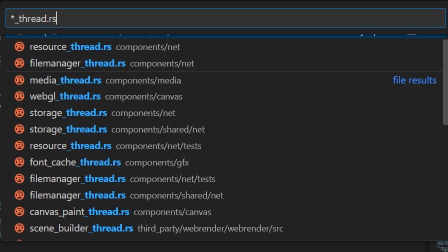

# inbox

canvas/offscreen

libaom

b handle_stylesheet_url

document_from_node


cssparser
    tokenizer

./mach test-unit --nocapture -- test_column_width

rust-gdb /vagrant/target/debug/deps/libzfs-37d0dad38d98d030

r --test

./mach test-tidy --no-progress --all

[2024-03-19T11:47:14Z DEBUG script::dom::htmlscriptelement] script type=

RUST_LOG="debug" ./mach run -d -- http://192.168.43.1:8080/quill.html -i -y 1 /tmp/a.html 2>&1 | ts -s "%.S: " | tee /tmp/log.txt


servo

impl CompositorReceiver {
    pub fn try_recv_compositor_msg(&mut self) -> Option<CompositorMsg> {
        self.receiver.try_recv().ok()
    }
    pub fn recv_compositor_msg(&mut self) -> CompositorMsg {
        self.receiver.recv().unwrap()
    }
}


lazy_static

https://github.com/servo/servo/issues/31648


Windowproxy
#[no_trace]
[allow(unsafe_code)]

p *(char*)buf

Promise.resolve()
    .then(() => console.log(1));

queueMicrotask(() => console.log(2));

setTimeout(() => console.log(3), 0);

console.log(4);

new Promise(() => console.log(5));

(async () => console.log(6))();

b __libc_write if fd < 3

Fix support for the DevTools protocol in Servo


Add support for language-specific `text-transform` behavior
https://drafts.csswg.org/css-text/#text-transform
https://github.com/chromium/chromium/commits?author=tkent-google
https://github.com/search?q=repo%3Achromium%2Fchromium+text-transform&type=commits


https://github.com/servo/servo/commits?author=sagudev CI

./mach run -d -- --debug help

$env:RUST_LOG="debug" # Setting environment variable

rust-gdb ./target/debug/servo

./target/debug/servo ./tests/wpt/tests/css/css-text/text-transform/math/text-transform-math-auto-001.html
r ./tests/wpt/tests/css/css-text/text-transform/math/text-transform-math-auto-001.html
./mach run -d -- ./tests/wpt/tests/css/css-text/text-transform/math/text-transform-math-auto-001.html
./mach run -d -- ./tests/wpt/tests/css/css-tables/tentative/table-width-redistribution.html

r ./tests/wpt/tests/css/css-tables/tentative/table-width-redistribution.html

b components/layout_2020/table/layout.rs:411

./mach run --debugger=rr -- ./tests/wpt/tests/css/css-tables/tentative/table-width-redistribution.html

./mach run -d -- --debug dump-display-list test.html -z


rust default allocator is jemalloc

The reference to use-system-allocator = ["libc"] seems to be a configuration snippet possibly from a Cargo.toml file for a Rust project, specifying a dependency feature. In Rust projects, this line would indicate that a crate is configured to use the system's allocator (typically provided by libc) instead of Rust's default allocator. 

https://github.com/servo/servo/commits/?author=atbrakhi

#[dom_struct]
pub struct Event {
    reflector_: Reflector,
    current_target: MutNullableDom<EventTarget>,
    target: MutNullableDom<EventTarget>,
}

constellation send event ot script thread

script_thread handle_event -> document.dispatch

Event self.getTarget -> Node -> Node -> VirtualMethod -> htmlinputelement


rust-gdb

script::dom::htmlinputelement::HTMLInputElement
script::script_thread::ScriptThread::handle_msgs


https://github.com/search?q=repo%3Aservo%2Fservo%20pub%20struct%20EventTarget&type=code

pub struct Element {
    node: Node,

}

pub struct Node {
    /// The JavaScript reflector for this node.
    eventtarget: EventTarget,


C:\Users\tannal\tannalwork\projects\servo\components\shared\embedder\lib.rs
impl EmbedderProxy {
    pub fn send(&self, msg: (Option<TopLevelBrowsingContextId>, EmbedderMsg)) {
        // Send a message and kick the OS event loop awake.
        if let Err(err) = self.sender.send(msg) {
            warn!("Failed to send response ({:?}).", err);
        }
        self.event_loop_waker.wake();
    }
}

script_thread handle_msg from xxx 


sudo apt install moreutils

servo/components/shared/embedder
/resources.rs

HTML5 Forms

HTMLInputElement

components\script\dom\htmlinputelement.rs

./mach run --pref dom.svg.enabled https://vuejsfeed.com/
./mach run --pref dom.svg.enabled https://hn.algolia.com/ -i -y 1 2>&1 | % {
    # Adding timestamp using Get-Date and formatting output
    "$(Get-Date -Format "HH:mm:ss.fff"): $_"
} | Out-File -FilePath "log.txt"

box and interator in rust

Top level functions & functions always appear in the bottom callstack
components/layout_2020/flow/construct.rs BlockContainer Builder finish()

let collapsed_string: String = collapsed.collect();

ifc Inline formating context

components\style\values\specified\text.rs

match_ignore_ascii_case!

./mach run -d -- -i -y 1 2>&1 | % {
    # Adding timestamp using Get-Date and formatting output
    "$(Get-Date -Format "HH:mm:ss.fff"): $_"
} | Out-File -FilePath "log.txt"


$env:RUST_LOG="debug" # Setting environment variable
./mach run -d -- ./tests/wpt/tests/css/CSS2/text/text-transform-001.xht -i -y 1 2>&1 | % {
    # Adding timestamp using Get-Date and formatting output
    "$(Get-Date -Format "HH:mm:ss.fff"): $_"
} | Tee-Object -FilePath "log.txt"

./mach run -d -- ./tests/wpt/tests/css/CSS2/linebox/crashtests/dir-change-simplifed-crash.html

./mach run -d -- ./tests/wpt/tests/html/semantics/embedded-content/the-video-element/intrinsic_sizes.htm

./mach run -d -- ./tests/wpt/tests/html/canvas/element/text/parent-style-relative-units.htm


CodegenRust.py

Custom Attribute

https://github.com/servo/servo/issues/30822

pgrep -l servo
pstree -p 29349
ps -T -p 29349

LayoutPipeLine

session history chrome://history/

00.376324:  [2024-01-19T05:42:55Z DEBUG constellation::constellation] Pipeline(1,1): Creating new pipeline in BrowsingContext(0,1)

https://www.youtube.com/watch?v=PyfY82-NDCM

https://github.com/servo/servo/issues/30862

# threads & subproccesses

```
"servo" 
"servo:cs0"
"servo:disk$0"
"servo:sh0"   
"servo:shlo0" 
"servo:gdrv0" 
"servo:sh1"   
"servo:sh2" 
```


components/layout_thread_2020/lib.rs:261 layout thread
components/script/script_thread.rs:840 script thread
components/style/global_style_data.rs:64
mozjs thread jsHelper
servo media gstreamer
components/net/resource_thread.rs resource manager

components/background_hang_monitor/background_hang_monitor.rs
detect when these background tasks become unresponsive or "hang."

components/bluetooth/lib.rs

third_party/webrender/webrender/src/renderer/mod.rs:1269 web render thread

third_party/webrender/webrender/src/renderer/mod.rs:1191 web render scene builder

webrender worker thread same as the core number


# types

A strong reference to a rule node.
use crate::rule_tree::StrongRuleNode; style crate rule_tree module type StrongRuleNode

ScriptThread
LayoutThread

ScriptThread
 - handle_msgs
 - 


# dependency

url 2.5.0

```
pub enum Host<S = String> {
    Domain(S),
    Ipv4(Ipv4Addr),
    Ipv6(Ipv6Addr),
}

```

## windows

```
choco install python311

setx PYTHON3 "C:\Python11\python.exe" /m

setx PYTHON3 "C:\Python12\python.exe" /m

vs_BuildTools.exe^
    --add Microsoft.VisualStudio.Component.Roslyn.Compiler^
    --add Microsoft.Component.MSBuild^
    --add Microsoft.VisualStudio.Component.CoreBuildTools^
    --add Microsoft.VisualStudio.Workload.MSBuildTools^
    --add Microsoft.VisualStudio.Component.Windows10SDK^
    --add Microsoft.VisualStudio.Component.Windows10SDK.20348^
    --add Microsoft.VisualStudio.Component.VC.CoreBuildTools^
    --add Microsoft.VisualStudio.Component.VC.Tools.x86.x64^
    --add Microsoft.VisualStudio.Component.VC.Redist.14.Latest^
    --add Microsoft.VisualStudio.Component.VC.ATL^
    --add Microsoft.VisualStudio.Component.VC.ATLMFC^
    --add Microsoft.VisualStudio.Component.TextTemplating^
    --add Microsoft.VisualStudio.Component.VC.CoreIde^
    --add Microsoft.VisualStudio.ComponentGroup.NativeDesktop.Core^
    --add Microsoft.VisualStudio.Workload.VCTools


$ v := vec(x_1, x_2, x_3) $


```bash

git clone https://github.com/servo/servo/

sudo apt install python3.10-venv

export PIP_EXTRA_INDEX_URL=https://pypi.tuna.tsinghua.edu.cn/simple

pip config set global.index-url https://pypi.tuna.tsinghua.edu.cn/simple

mach bootstrap

mach build

```


https://starters.servo.org/

set MOZTOOLS_PATH=C:\Users\tannal\Downloads\moztools-4.0\moztools-4.0\
set LIBCLANG_PATH=C:\Program Files\LLVM\lib

```


WebIDL

unsafe keyword in rust

https://github.com/servo/servo/issues/30862

In components/script, remove unsafe JS related code

 creating a rooted JSObject

```md
<!-- Please describe your changes on the following line: -->
''=

---
<!-- Thank you for contributing to Servo! Please replace each `[ ]` by `[X]` when the step is complete, and replace `___` with appropriate data: -->
- [ ] `./mach build -d` does not report any errors
- [ ] `./mach test-tidy` does not report any errors
- [ ] These changes fix #___ (GitHub issue number if applicable)

<!-- Either: -->
- [ ] There are tests for these changes OR
- [ ] These changes do not require tests because ___

<!-- Also, please make sure that "Allow edits from maintainers" checkbox is checked, so that we can help you if you get stuck somewhere along the way.-->

<!-- Pull requests that do not address these steps are welcome, but they will require additional verification as part of the review process. -->

```

# Vscode setup

```json
// .vscode/settings.json
{
    "rust-analyzer.check.overrideCommand": [
        "./mach", "check", "--message-format=json" ],
    "rust-analyzer.cargo.buildScripts.overrideCommand": [
        "./mach", "check", "--message-format=json" ],
    "rust-analyzer.rustfmt.overrideCommand": [ "./mach", "fmt" ],
}


{
    "rust-analyzer.check.overrideCommand": [
        "./mach.bat", "check", "--message-format=json" ],
    "rust-analyzer.cargo.buildScripts.overrideCommand": [
        "./mach.bat", "check", "--message-format=json" ],
    "rust-analyzer.rustfmt.overrideCommand": [ "./mach.bat", "fmt" ],
}


```

# servo people

igalia delan rego robinson

(ex-)mozilia

jdm

Daniel Adams Gamepad API

Gregory Terzian

https://github.com/sagudev

other contributors


# layout 2020


box tree
                -> stacking context tree -> WebRender display list
fragment tree

For example, when a text sequence is broken into multiple lines or a block is broken across columns or pages, it yields multiple fragments in the tree.

```rust


pub struct DisplayList {
    pub list: Vec<DisplayItem>,
    pub clip_scroll_nodes: Vec<ClipScrollNode>,
}


```

# servo docs/wiki is outdated

many errors and troubleshooting need to do when go through the docs on computer.

I'm planning to improve some docs.

need some feedback from the servo team.

# good first issues

https://github.com/servo/servo/issues/31006 

https://github.com/servo/servo/issues/31007

# issue tags

E-candidate-for-mentoring https://github.com/servo/servo/labels/E-candidate-for-mentoring

A-content/script https://github.com/servo/servo/labels/A-content%2Fscript

# issues

Implement ResizeObservers

```bash

./mach test-wpt --production _webgpu

./mach test-wpt tests/wpt/tests/dom/events/relatedTarget.window.js

./mach test-wpt tests/wpt/tests/dom/events/relatedTarget.window.js


./mach test-wpt ./tests/wpt/meta/css/CSS2/text/text-transform* 

```

https://servo.org/blog/

https://wpt.servo.org/

https://github.com/servo/servo/wiki/Servo-Layout-Engines-Report

cross platform windows linux macos android

embeddedable dioxus tauri Delta chat

servo is experimental

controlled environment

- Embeddedable

2012-2020 


- Memory Safe
- Independence
- 


```bash


sudo apt update

sudo apt install git

git clone https://www.github.com/tannal/tannalwork/

git submodule update --init .

git clone https://www.github.com/servo/servo


# sudo apt install python3-pip python-is-python3l

pip install virtualenv --break-system-packages
curl --proto 'ls=https' --tlsv1.2 -sSf https://sh.rustup.rs | sh

./mach bootstrap

sudo apt install m4

time ./mach build


# on my arm cortex A76 raspi 5

real	10m56.115s
user	32m57.548s
sys	3m14.510s


./mach build
./mach run


```

dependency bot update dependecies version

jsdom jest

take advantage of dom implementation of servo

create 

Q: Where does the code change window sizing


00.382039:  [2024-01-19T05:42:55Z WARN  constellation::constellation] Trying to get an event-loop from an unknown browsing context group


window
  headed_window
  headless_window

browser
  window: Rc<Window>

compositor
  window: Rc<Window, Global>


constellation: Constellation<Message, LTF, STF, SWF>
  window_size: 
  shutting_down:
  get_event_loop()
  new_pipeline()

```rust
#0  servo::headed_window::Window::new
    (win_size=..., events_loop=0x7fffffff8290, no_native_titlebar=false, device_pixel_ratio_override=...) at ports/servoshell/headed_window.rs:145
#1  0x0000555556085f98 in servo::app::App::run
    (no_native_titlebar=false, device_pixel_ratio_override=..., user_agent=..., url=...) at ports/servoshell/app.rs:75
#2  0x000055555609360d in servo::main2::main ()
    at ports/servoshell/main2.rs:139
#3  0x0000555556164c16 in servo::main () at ports/servoshell/main.rs:62

```

components/servo/lib.rs

style/

script/ mozjs

constellation/

layout_thread_2020/

# servo architecture

event system


native fullscreen

fullscreen web api


# GPT-QA

## CSS 2

style.rs: This file defines the core data structures and algorithms for CSS styling in Servo. Understanding how styles are computed and applied is crucial for adding new CSS2 features.

dom.rs: This file contains the implementation of the Document Object Model (DOM) in Servo. The DOM represents the structure of web pages, and modifying it correctly is essential for supporting new CSS2 features.

layout.rs: This file encompasses the layout engine of Servo. It handles the positioning and rendering of elements on the web page. Understanding layout is crucial for implementing new CSS2 features that affect the visual rendering of elements.

parser.rs: This file deals with parsing CSS and HTML in Servo. Familiarizing yourself with the parsing logic is important for correctly handling new CSS2 features in terms of syntax and structure.

properties.rs: This file defines the various CSS properties supported by Servo. Adding new CSS2 features often involves extending or modifying the existing property definitions.

style_traits.rs: This file contains trait definitions and helper functions for working with CSS styles in Servo. It provides a foundation for implementing and manipulating CSS2 features.

selectors.rs: This file handles CSS selector matching and specificity calculations. Understanding how selectors are processed is important for supporting new CSS2 selectors.

paint.rs: This file deals with painting and rendering operations in Servo. Depending on the CSS2 feature you want to add, you may need to modify the painting logic to achieve the desired visual effect.

computed_values.rs: This file defines the computed values for CSS properties. Understanding how computed values are derived and used is important for correctly implementing new CSS2 features.

style_builder.rs: This file contains the logic for building the style tree in Servo. It handles cascading, inheritance, and applying styles to elements. Understanding the style building process is crucial for correctly handling new CSS2 features.

## Multiple concurrent top-level browsing contexts

browser.rs: This file represents the browser context in Servo and manages the top-level browsing contexts. Understanding how the browser context is created, managed, and interacts with other components is crucial for implementing multiple concurrent top-level browsing contexts.

document.rs: This file represents the web document in Servo and handles the construction, modification, and layout of the document. Understanding how documents are managed and how they relate to browsing contexts is important for enabling multiple concurrent top-level browsing contexts.

frame_tree.rs: This file represents the frame tree structure in Servo, which organizes the hierarchy of frames within a browsing context. Understanding how frames are structured and how they relate to browsing contexts is crucial for implementing multiple concurrent top-level browsing contexts.

script_thread.rs: This file handles the execution of JavaScript and manages the event loop in Servo. Understanding how scripts are executed and how events are processed is important for enabling concurrent execution and event handling across multiple browsing contexts.

layout.rs: This file contains the layout engine of Servo, responsible for positioning and rendering elements. Understanding how layout is performed and how it interacts with browsing contexts is important for ensuring proper rendering across multiple concurrent top-level browsing contexts.

dom.rs: This file contains the implementation of the Document Object Model (DOM) in Servo. Familiarizing yourself with the DOM structure and how it relates to browsing contexts is crucial for enabling multiple concurrent top-level browsing contexts.

parser.rs: This file deals with parsing HTML and CSS in Servo. Understanding how parsing is performed and how it relates to browsing contexts is important for correctly handling and managing the creation of multiple concurrent top-level browsing contexts.

window.rs: This file represents the windowing system integration in Servo. Understanding how Servo interacts with the windowing system is important for managing multiple concurrent top-level browsing contexts and their associated windows.

ipc.rs: This file handles inter-process communication in Servo. Depending on the implementation approach for multiple concurrent top-level browsing contexts, you may need to modify the IPC mechanisms to ensure proper communication between the browsing contexts.

glue.rs: This file contains various glue code that connects different parts of Servo. Understanding the glue code related to browsing contexts and their interactions will help you grasp the overall architecture and integration of multiple concurrent top-level browsing contexts.

# code search

Matching complex selector

mach run

sudo apt install moreutils

RUST_LOG="debug" ./mach run -d -- -i -y 1 /tmp/a.html 2>&1 | ts -s "%.S: " | tee /tmp/log.txt

RUST_LOG="debug" ./mach run -d -- -i -y 1  2>&1 | ts -s "%.S: " | tee /tmp/log.txt

$env:RUST_LOG="debug" # Setting environment variable
./mach run -d -- -i -y 1 2>&1 | % {
    # Adding timestamp using Get-Date and formatting output
    "$(Get-Date -Format "HH:mm:ss.fff"): $_"
} | Tee-Object -FilePath "log.txt"


./mach test-wpt tests/wpt/tests/dom/events/relatedTarget.window.js

llvm git cmake python python-virtualenv wixtoolset ninja vs2019


sudo apt install libopts25-dev m4
sudo apt install libots-dev


```bash
// script_thread.rs
handle_resize_inactive_msg

```


build errors on windows


```bash


  --- stderr
  bash.exe: warning: could not find /tmp, please create!
  bash.exe: warning: could not find /tmp, please create!
  bash.exe: warning: could not find /tmp, please create!
  bash.exe: warning: could not find /tmp, please create!
  bash.exe: warning: could not find /tmp, please create!
  bash.exe: warning: could not find /tmp, please create!
  cat: config.log: No such file or directory
  mozmake: *** [C:\Users\tannal\.cargo\git\checkouts\mozjs-fa11ffc7d4f1cc2d\f452fb2\mozjs-sys\makefile.cargo:157: maybe-configure] Error 1
  thread 'main' panicked at 'assertion failed: result.success()', C:\Users\tannal\.cargo\git\checkouts\mozjs-fa11ffc7d4f1cc2d\f452fb2\mozjs-sys\build.rs:246:5
  note: run with `RUST_BACKTRACE=1` environment variable to display a backtrace


```